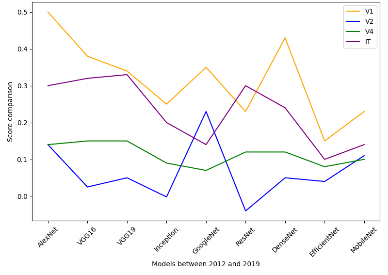
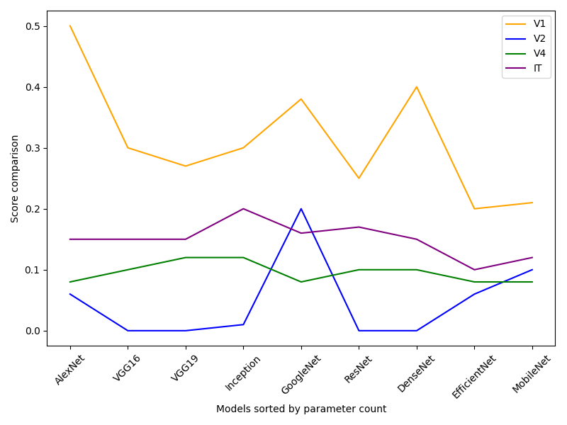

<h1>ImageBrainDL</h1> 
# Introduction

The objective of our study is to assess the extent to which computer vision models, trained on large datasets, <br>
succeed in replicating human brain neural activities or measured behaviors, based on the scores provided by the <br>
Brainscore library. This platform offers an integrative and standardized approach to comparing the activations of <br>
artificial models with neural and behavioral measurements. It aims to provide precise and executable computational <br>
models to explore the parallels between the architecture of artificial models and the functioning of the human brain.<br>

We aim to determine whether the similarity score, comparing the activations of different model layers with human neural<br>
activities, increases, and to identify the factors responsible for this increase. Is this evolution attributable to the <br>
growing size of the models, defined by a greater number of parameters, or to the continuous advancements in architectures <br>
and training methods, linked to their year of design ? <br> 

Consequently, these research questions seek to evaluate whether recent models offer a more accurate match with human <br>
data and to better understand the specific elements underlying this improvement. This will not only clarify the mechanisms <br>
driving the evolution of these models but also shed light on how these advancements influence the quality of <br>
their correspondence with human neural processes.<br>

# Methodology

In our research, we utilized the datasets provided by Brainscore, a platform that compiles neural imaging data, <br>
including neuronal recordings and behavioral data associated with visual stimuli. Specifically, we selected <br>
the MajajHong2015 dataset, which includes neuronal recordings from the IT and V4 cortical areas, and the FreemanZiemba2013 <br>
dataset, which focuses on activations in the V1 and V2 areas of macaque brains. These datasets enable the evaluation <br>
of models based on their ability to replicate observed activations in these cortical regions. <br>


We selected a variety of vision models spanning both classical and more modern architectures, including AlexNet (2012), <br>
VGG16/VGG19 (2014), ResNet (2015), and EfficientNet (2019). These architectures vary in depth (number of layers), size <br>
(number of parameters), and date of creation, providing a diverse set of models for exploring factors that influence <br>
performance. Each model was tasked with classifying images from the two selected datasets.

In this context, we extracted the activations from the final layers of these models and compared them to the neural data<br>
provided by the selected datasets. The comparisons were made using similarity scores, which quantify the correspondence <br>
between model activations and those observed in the brain.<br>

We conducted two primary analyses:<br>

- Temporal Progression of Similarity Scores: This analysis examined whether similarity scores increased over time, <br>
as measured by the year of model creation. This tested the hypothesis that more recent architectures better capture <br>
neural activations. <br>
- Impact of Model Size: This analysis investigated whether architectures with a larger number of parameters demonstrated <br>
a stronger correspondence with neural data, independent of their creation date.<br>

Lastly, we evaluated the models using the specific benchmarks provided by Brainscore, analyzing their ability to <br> 
replicate the neuronal properties of the targeted visual areas (V1, V2, V4, IT). This allowed us to assess how modern <br>
architectures align with the neural dynamics of visual processing observed in both human and animal brains. <br>

# Results

Let us now turn to the results. We begin by analyzing the graph below (Figure 1), which presents the comparison scores <br>
for the four activation layers (V1, V2, V4, IT) based on models ordered chronologically by their year of creation. <br>

Recall our hypothesis that newer models would offer better modeling performance. Contrary to this assumption, AlexNet,  <br>
the oldest model, stands out as the best-performing model for three of the four cortical regions (V1, V4, IT), achieving  <br>
the highest scores. Over the years, a general decline in performance is observed, except for GoogleNet, which performs  <br>
well for V1 (orange) and achieves the highest score for V2 (blue) among all studied models. However, V2 remains  <br>
the most challenging region to model across all architectures. Scores for the V4 region (green) remain relatively  <br>
consistent across models, while the IT (purple) and V1 regions are better captured by model activations.  <br>
Following a recovery in performance with architectures like ResNet and DenseNet, a notable decline is observed  <br>
with more recent models such as EfficientNet and MobileNet. <br>

In summary, our results indicate that recent networks do not necessarily outperform their predecessors.  <br>
AlexNet remains the best-performing model, contradicting our initial hypothesis that newer architectures would <br>
provide a more accurate match with neural data. These findings highlight that advancements in model design do not  <br>
automatically translate to improved modeling capabilities. <br>



Let us now determine whether models with a larger number of parameters are also those that demonstrate better <br>
performance, regardless of their year of creation, which addresses our second hypothesis. <br>

Below, a graph (Figure 2) illustrates the performance of the models based on the number of parameters for each cortical region.<br>



# Analysis of Performance by Model Size

The best-performing model for the V1 layer is AlexNet (62 million parameters). <br>
We observe a decreasing trend in performance with VGG16 (138 million parameters) and VGG19 (144 million parameters). <br>
However, performance improves with GoogleNet (7 million parameters) and DenseNet (20 million parameters), followed by <br>
another decline with EfficientNet (19 million parameters) and MobileNet (4.2 million parameters). <br>
These observations suggest that model size, in terms of the number of parameters, <br>
is not directly correlated with performance in modeling V1.<br>

For V2, overall performance is low across most models, except for GoogleNet, which achieves the highest score for this <br>
region with only 7 million parameters. This suggests that model size has a negligible impact on the ability to model V2. <br>
Instead, other factors, such as architectural specifics, may be more crucial for this region.<br>

The scores for V4 remain relatively stable, showing no significant variation with model size. <br>
This indicates that neither size nor complexity substantially affects performance for this region. <br>
If these factors were influential, we would expect noticeable differences between models with the fewest and the most parameters.<br>

For IT, scores remain relatively stable across most models, with slight improvements seen for Inception <br>
(55 million parameters) and ResNet (25.7 million parameters).<br>
Conclusion

Our second hypothesis, which posited that the number of parameters would be a determining factor in the ability to <br>
model neuronal activations, is not supported by these results. Performance does not exhibit a linear relationship with model size. <br>
This suggests that other factors, such as architectural innovations, optimization strategies, or specific design choices,<br>
may play a more significant role in determining performance across cortical regions.<br>


# Discussion and Conclusion

Our results reveal that neither the recency of the models nor their size (in terms of the number of parameters) <br>
are determining factors for their performance. However, several limitations warrant discussion. <br>
First, our analysis relies solely on two datasets (MajajHong2015 and FreemanZiemba2013), which constrains <br>
the generalizability of our findings. These datasets are based on neuronal data from experiments conducted on macaques. <br>
While relevant, they may not fully capture the complexity of the human brain.<br>

Furthermore, our analysis focused primarily on two dimensions: the models' year of creation and the number of parameters. <br>
This approach overlooks other important characteristics, such as architectural specifics or the hyperparameters used during training. <br>
These factors may play a crucial role in modeling neuronal activations and deserve further investigation. <br>
In brief, our conclusion raises new questions about the features that truly influence the ability to model <br>
neuronal activations.<br>

To advance this work, future research could leverage a broader variety of datasets and explore recent models with a <br>
focus on aspects such as architecture, training strategies, and the analysis of intermediate layers. <br>
This could provide a more nuanced understanding of the factors underlying model performance in the context <br>
of neuronal processes.<br>

In summary, our study sought to investigate model performance by addressing whether they improve over time and whether <br>
networks with a larger number of parameters outperform smaller ones in modeling neuronal activities. <br>
However, our initial hypotheses—that recency and model size are key determinants—were not confirmed. <br>
These findings highlight the complexity of interactions between model characteristics and performance, <br>
suggesting that other factors may play a more prominent role. Future studies will be essential to uncover <br>
these influences more comprehensively.<br>


## Installation
Before compiling the report, you need to set up a Python environment and install the necessary dependencies.
```shell
conda create --name imagebraindl python=3.11.10
```

```shell
conda activate imagebraindl
```

```shell
pip install git+https://github.com/brain-score/vision.git
```

```shell
pip install -r requirements.txt
```


## Authors
- Marius THORRE (M2-IAAA)
- Lucie COUSSEMENT (M2-MASCO)
- Jade NOIROT (M2-MASCO)
